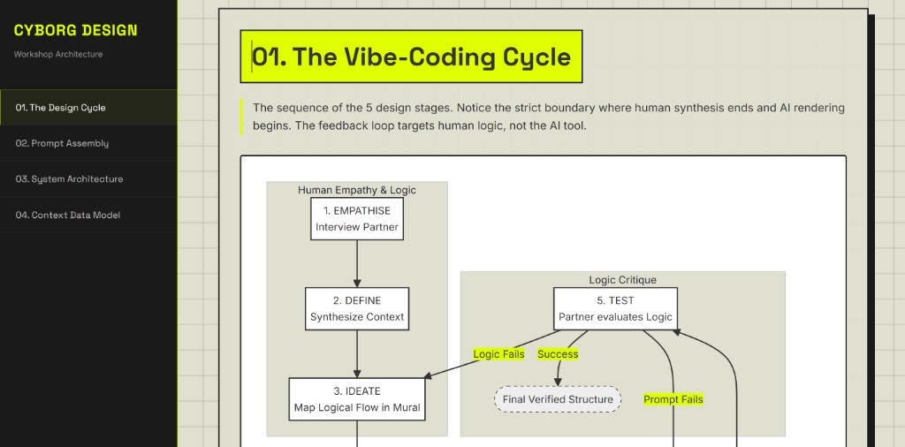

# Fundamentals of Innovation Literacy

**Cyborg Design Workshop Architecture**

Welcome to the Fundamentals of Innovation Literacy workshop repository.

This methodology forces abstract workshop pedagogy into strict architectural boundaries. The process explicitly defines the "Human Phase" (empathy, definition, and logical mapping) versus the "Machine Phase" (where AI acts strictly as a constrained rendering engine).

### The Architecture
1. **The Vibe-Coding Cycle**: The 5 design stages (Empathise → Define → Ideate → Prototype → Test) and how data flows from the human interview through the AI generation and back to human critique.
2. **Prompt Assembly**: The workflow merging User Context Profile, Mural Flow, Style Guide, and Design System into a master prompt for the LLM.
3. **System Architecture**: The architectural components of the prompt system: Source Documents acting as base constraints, and User Context as dynamic input.
4. **Context Data Model**: The structure of the data generated in the Define stage.

*(See the full interactive architecture documentation via the HTML visualisations in the repository).*

---
*Inspired by the FUJI Method for structured AI output.*